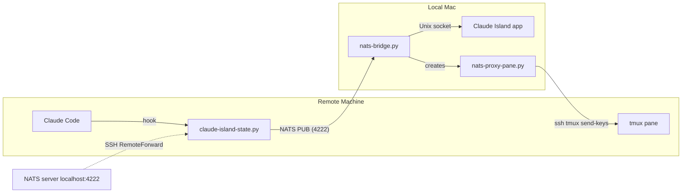

# NATS Remote Session Support for Claude Island

Forward Claude Code events from remote SSH sessions to Claude Island on your local Mac, with full permission approve/deny support and message relay via tmux proxy panes.

## Architecture



### Event Flow

1. **State events** — Claude Code hook publishes to `claude.island.state` via raw NATS protocol (no pip dependencies on remote). The bridge forwards to Claude Island's Unix socket.

2. **Permission requests** — Hook uses NATS request/reply on `claude.island.permission`. The bridge forwards to Claude Island, waits for approve/deny (up to 5 min), and replies back.

3. **Message relay** — The bridge creates a tmux proxy pane per remote session. Claude Island sends keystrokes to the proxy pane via `tmux send-keys`. The proxy pane relays each line to the remote machine via `ssh <host> tmux send-keys`.

4. **Transcripts** — The bridge writes `.jsonl` transcript files locally so Claude Island can display conversation history for remote sessions.

## Prerequisites

1. **NATS server** running on your local Mac:
   ```bash
   brew install nats-server
   nats-server &
   ```

2. **SSH RemoteForward** — forward NATS port to the remote machine. Add to `~/.ssh/config`:
   ```
   Host myserver
     HostName myserver.example.com
     RemoteForward 4222 localhost:4222
   ```

3. **nats-py** Python package on local Mac (for the bridge):
   ```bash
   pip install nats-py
   ```

4. **tmux** on both local and remote machines.

## Installation

### Remote Machine

Install the hook script in your Claude Code hooks config (`~/.claude/settings.json`):

```json
{
  "hooks": {
    "UserPromptSubmit": [{ "command": "python3 /path/to/claude-island-state.py" }],
    "PreToolUse": [{ "command": "python3 /path/to/claude-island-state.py" }],
    "PostToolUse": [{ "command": "python3 /path/to/claude-island-state.py" }],
    "PermissionRequest": [{ "command": "python3 /path/to/claude-island-state.py" }],
    "Notification": [{ "command": "python3 /path/to/claude-island-state.py" }],
    "Stop": [{ "command": "python3 /path/to/claude-island-state.py" }],
    "SubagentStop": [{ "command": "python3 /path/to/claude-island-state.py" }],
    "SessionStart": [{ "command": "python3 /path/to/claude-island-state.py" }],
    "SessionEnd": [{ "command": "python3 /path/to/claude-island-state.py" }],
    "PreCompact": [{ "command": "python3 /path/to/claude-island-state.py" }]
  }
}
```

The hook auto-detects SSH sessions and uses NATS transport when the Unix socket is unavailable. No pip dependencies needed on the remote machine — it uses raw NATS protocol over TCP.

### Local Mac

Start the bridge daemon:

```bash
python3 scripts/remote/nats-bridge.py start
```

The bridge will:
- Subscribe to NATS subjects for state and permission events
- Forward events to Claude Island via Unix socket
- Write transcript `.jsonl` files to `~/.claude/projects/`
- Create tmux proxy panes for message relay (using SSH alias from `~/.ssh/config`)

### SSH Host Resolution

The bridge parses `~/.ssh/config` (including `Include` directives) to build a `HostName → alias` mapping. When a remote machine reports its FQDN, the bridge resolves it to your SSH alias for proxy pane SSH connections.

Supports:
- Exact hostname match
- Prefix/suffix matching (short hostname vs FQDN)
- Kubernetes pod hostname → service FQDN resolution

## launchd Agent (Auto-Start)

Create `~/Library/LaunchAgents/com.claude-island.nats-bridge.plist`:

```xml
<?xml version="1.0" encoding="UTF-8"?>
<!DOCTYPE plist PUBLIC "-//Apple//DTD PLIST 1.0//EN" "http://www.apple.com/DTDs/PropertyList-1.0.dtd">
<plist version="1.0">
<dict>
    <key>Label</key>
    <string>com.claude-island.nats-bridge</string>
    <key>ProgramArguments</key>
    <array>
        <string>/usr/bin/python3</string>
        <string>/path/to/scripts/remote/nats-bridge.py</string>
        <string>start</string>
    </array>
    <key>RunAtLoad</key>
    <true/>
    <key>KeepAlive</key>
    <true/>
    <key>StandardOutPath</key>
    <string>/tmp/nats-bridge.log</string>
    <key>StandardErrorPath</key>
    <string>/tmp/nats-bridge.log</string>
</dict>
</plist>
```

Load it:

```bash
launchctl load ~/Library/LaunchAgents/com.claude-island.nats-bridge.plist
```

## Commands

```bash
# Bridge daemon
python3 nats-bridge.py start    # run in foreground
python3 nats-bridge.py stop     # stop the daemon
python3 nats-bridge.py status   # check if running

# Check logs
tail -f /tmp/nats-bridge.log
```

## Troubleshooting

- **No events arriving** — verify NATS is running (`nats-server -V`) and SSH RemoteForward is active (`ssh -O check myserver`)
- **Permission requests timing out** — ensure Claude Island is running and its Unix socket exists at `/tmp/claude-island.sock`
- **Proxy pane SSH failures** — check that `ssh-add -l` shows keys, and the SSH alias in `~/.ssh/config` matches the remote hostname
- **Transcript not showing** — verify `~/.claude/projects/` is writable and Claude Island is configured to read from that path
